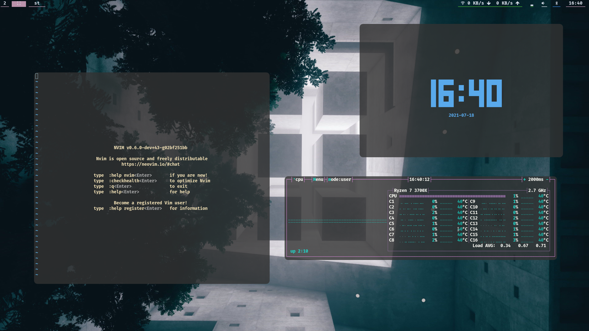

# sck
Fork of dwm including a polybar configuration based on  and the following patches

* dwm-actualfullscreen-20191112-cb3f58a.diff
* dwm-anybar-20200905-bb2e722.diff
* dwm-focusadjacenttag-6.0.diff
* dwm-ipc-20201106-f04cac6.diff
* dwm-pertag-6.2.diff
* dwm-push-20201112-61bb8b2.diff

with some additional fixes, for example, *focusadjacenttag* does not work out of the box with *pertag*. 

The paths referenced in `dwm/config.h` for `launch.sh` and scripts under `~/linsc` need to be modified upon installation and the polybar configurations under `dwm/polybar` needs to be moved into `~/.config/polybar`. Changes based on the particular environment such as monitor, font size etc. can be tweaked in `polybar/config.ini`. 



## dwm

### Controls
* Quit X: <kbd>Meta</kbd> <kbd>Ctrl</kbd> <kbd>Shift</kbd> <kbd>q</kbd> 
* Cycle between windows: <kbd>Meta</kbd> <kbd>Tab</kbd> or <kbd>Ctrl</kbd> <kbd>q</kbd>
* Close current window: <kbd>Meta</kbd> <kbd>q</kbd>
* Tiled layout: <kbd>Meta</kbd> <kbd>g</kbd>
	* Resize windows horizontally: <kbd>Meta</kbd> <kbd>h</kbd> / <kbd>Meta</kbd> <kbd>l</kbd>
	* Move current window in the stack: <kbd>Meta</kbd> <kbd>j</kbd> / <kbd>Meta</kbd> <kbd>k</kbd>
* Floating layout: <kbd>Meta</kbd> <kbd>f</kbd>
	* Resize windows: <kbd>Meta</kbd> <kbd>Right mouse button</kbd>
	* Move windows: <kbd>Meta</kbd> <kbd>Left mouse button</kbd>
* Monocle layout: <kbd>Meta</kbd> <kbd>m</kbd>
* Fullscreen current window: <kbd>Meta</kbd> <kbd>Shift</kbd> <kbd>f</kbd>
* Screenshot (saves to `~/Pictures/Screens` by default): <kbd>Meta</kbd> <kbd>Shift</kbd> <kbd>3</kbd>
* Open emoji picker: <kbd>Ctrl</kbd> <kbd>Shift</kbd> <kbd>Space</kbd> 
* Open dmenu: <kbd>Meta</kbd> <kbd>Space</kbd> 
* Open browser: <kbd>Meta</kbd> <kbd>b</kbd> 
* Open `pulsemixer`: <kbd>Meta</kbd> <kbd>p</kbd> 
* Save current clipboard contents to `/tmp/local-clip`: <kbd>Meta</kbd> <kbd>Shift</kbd> <kbd>s</kbd> 
* Load contents of `/tmp/rem-clip` into clipboard: <kbd>Meta</kbd> <kbd>Shift</kbd> <kbd>l</kbd> 

## st

### Controls
* Scroll: <kbd>Ctrl</kbd> <kbd>j</kbd> / <kbd>Ctrl</kbd> <kbd>k</kbd>
* Zoom: <kbd>Ctrl</kbd> <kbd>+</kbd> / <kbd>Ctrl</kbd> <kbd>-</kbd>
* Reset zoom: <kbd>Ctrl</kbd> <kbd>0</kbd> 
* Copy selection: <kbd>Meta</kbd> <kbd>c</kbd>
* Paste selection: <kbd>Meta</kbd> <kbd>v</kbd>
* Open selection for URLs in the current buffer: <kbd>Meta</kbd> <kbd>o</kbd>


## Installation
```bash
pacman -S xorg-server xorg-xinit xorg-xset xclip xorg-wininfo xorg-xprop alsa-utils \
	feh imwheel maim \
	libxinerama yajl \
	noto-fonts noto-fonts-emoji 

yay -S libxft-bgra \
	picom-rounded-corners \
	ttf-fira-code  nerd-fonts-symbols
```

### GTK/Qt
Kvantum is used to set a style for all Qt apps, it requires `QT_STYLE_OVERRIDE=kvantum` to be loaded into the environment. Both GTK and Qt will be automatically configured with a dark version of *Adapta* when running `./install.bash all|confs`. 
```bash
pacman -S adapta-gtk-theme kvantum-qt5
```

## Polybar
The `monitor` option in `./confs/polybar.ini` needs to be manually modified to match one of the monitor names returned from `polybar --list-monitors`.

A patched version of polybar is required to display the current DWM layout, [polybar-dwm-module](https://github.com/mihirlad55/polybar-dwm-module), this version of polybar can be installed from the [AUR](https://aur.archlinux.org/packages/polybar-dwm-module) 

```bash
yay -S polybar-dwm-module
```

## Dmenu
Note that one may need to delete the cache at `~/.cache/dmenu_run` and potentially logout before dmenu is able to find all binaries in the `$PATH`.

## Emoji support
A patch to `libxft` is required to prevent st and dmenu from crashing when emojis are displayed. On Arch based distributions one can install a patched version of the library, [libxft-bgra](https://aur.archlinux.org/packages/libxft-bgra/) from the AUR. On Gentoo we can resolve this by introducing a [patch](https://wiki.gentoo.org/wiki//etc/portage/patches) into portage for the `libXft` library and (re)installing it
```bash
# Gentoo
sudo ./helper/libxft-patch.bash
```
