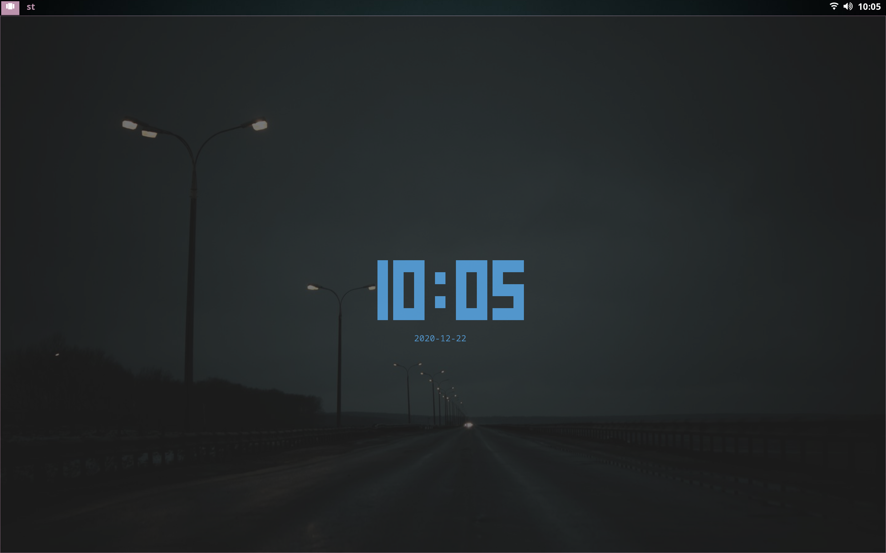

# sck
Forks of dwm, dmenu and Luke Smith's [st](https://github.com/LukeSmithxyz/st) build. The dwm build includes a polybar configuration and the following patches

* dwm-actualfullscreen-20191112-cb3f58a.diff
* dwm-anybar-20200905-bb2e722.diff
* dwm-focusadjacenttag-6.0.diff
* dwm-ipc-20201106-f04cac6.diff
* dwm-pertag-6.2.diff
* dwm-push-20201112-61bb8b2.diff

with some additional fixes, for example, *focusadjacenttag* does not work out of the box with *pertag*. 

